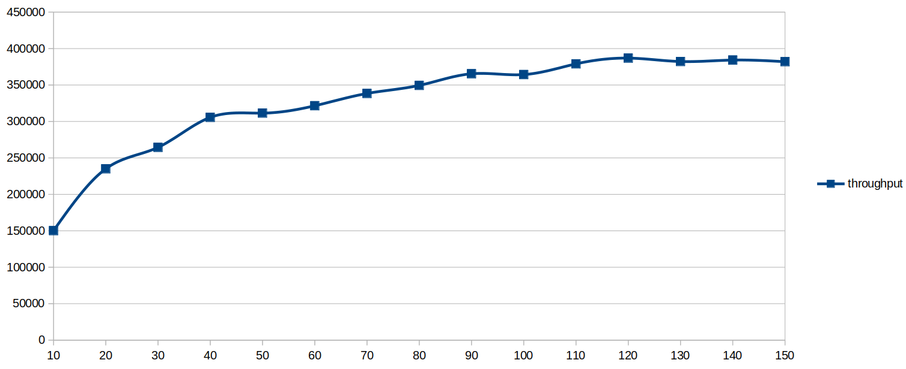

# max_connection settings
Avoid exceeding `max_connections` exceeding **10x** of the CPU count

## Problems of high number of connections
* Possibility of overloading and server become unresponsive / hang
* DoS attacks : System becomes easy target
* Lock Management overhead increases
* Memory utilization (Practically 10-50MB usage per connection is common)
* Snapshot overhead increases
Overall poor performance, responsiveness and stability issuse are often reported with databases with high `max_connection` values

## Best case benchmark result
 Even on a best case senario created using micro-benchmark, we could observe that the thoughput flattens as connections approches 10x of the CPU count  
 

## Key concepts to remember
* Each client connection is one process in the database server
* When client connection becomes active (some query to process) the corresponding process becomes runnable at the OS
* One CPU core can handle only 1 runable process at a time.
  * That means, if there are N CPU cores, There will be only N running processes.
* When Runable processes reaches the 5x-10x of the CPU count, Overall CPU utilization hits 100% .
  * There is no benefit of pushing for more concurency if the CPU utilization is hits its maximum.
* Multi-tasking / Context switches by OS gives the preception of multiple processes running by preempting the process frequently
* More runnable processes beyond the CPU counts results in processes waiting in scheduler queue for longer duration, which effectively results in poor performance.
* Increases the processes more just increases the contention in the system.
* PostgreSQL's supervisor process (so called postmaster) need to keep tab on each process it forked.
 * As the process count increases, The work of postmaster become inreases to get snapshot of what’s visible/invisible, committed/uncommitted (aka, Transaction Isolation)
 * It takes longer time to get  `GetSnapshotData()` as the work increases. This results in slow responce.
 * PostgreSQL processs caches the metadata accessed leading to incrased memory utilization over a time
 * Extension libraries will be loaded to the processes, which increases the memory footprint.
  
## Important Articles/References to Read
 1. [Why a high `max_connections` setting can be detrimental to performance](https://richyen.com/postgres/2021/09/03/less-is-more-max-connections.html)
 2. [Analyzing the Limits of Connection Scalability in Postgres](https://www.citusdata.com/blog/2020/10/08/analyzing-connection-scalability/) -- Memory and Poor snapshot scalability 
 3. [Measuring the Memory Overhead of a Postgres Connection](https://blog.anarazel.de/2020/10/07/measuring-the-memory-overhead-of-a-postgres-connection/)
 4. [Manage Connections Efficiently in Postgres](https://brandur.org/postgres-connections)

  
