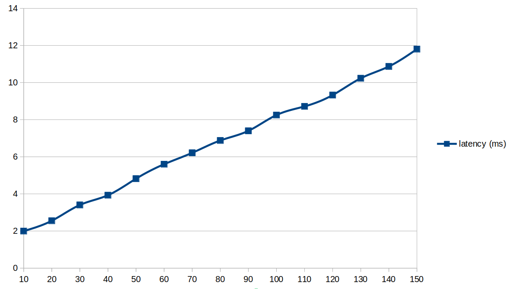

# max_connection settings
Avoid exceeding `max_connections` exceeding **10x** of the CPU count.

## Problems with the high number of connections

* Possibility of overloading and server becoming unresponsive / hang
* DoS attacks: System becomes an easy target
* Lock Management overhead increases.
* Memory utilization (Practically 10-50MB usage per connection is common)
* Snapshot overhead increases. 

Overall poor performance, responsiveness and stability issues are often reported with databases with high `max_connection` values.

## Best case benchmark result
Even in a best-case scenario created using a micro-benchmark, we can observe that the throughput flattens as connections approach 10x the CPU count.  
   
 But at the same time, the latency - the measure of responsiveness goes terrible.    
   
As the latency increases, individual SQL statements take longer to complete, often resulting in poor performance complaints. If the latency increases significantly, some systems may fail due to timeouts.

## Key concepts to remember
* Each client connection is one process in the database server.
* When the client connection becomes active (some query to process), corresponding process becomes runnable at the OS
* One CPU core can handle only one runable process at a time.
  * That means that if there are N CPU cores, there will only be N running processes.
* When runable processes reach 5x-10x of the CPU count, overall CPU utilization can hit 100%.
  * There is no benefit of pushing for more concurrency if the CPU utilization hits its maximum.
* Multi-tasking / Context switches by OS gives the preception of multiple processes running by preempting the process frequently. But context switches comes with big cost
* More runnable processes beyond the CPU counts results in processes waiting in scheduler queue for longer duration, which effectively results in poor performance.
* Increase in number of processes more than what the system could hanlde, just increases the contention in the system.
* PostgreSQL's supervisor process (so-called postmaster) needs to keep a tab on each process it forked. As the process count increases, The work of postmaster become inreases.
* As the number of sessions increases its become more complex to get snapshot of what’s visible/invisible, committed/uncommitted (aka, Transaction Isolation)
* It takes a longer time to getGetSnapshotData() as the work increases. This results in slow response.
 * PostgreSQL processs caches the metadata accessed leading to incrased memory utilization over a time
 * Extension libraries will be loaded to the processes, which increases the memory footprint.
  
## Important Articles/References to Read
 1. [Why a high `max_connections` setting can be detrimental to performance](https://richyen.com/postgres/2021/09/03/less-is-more-max-connections.html)
 2. [Analyzing the Limits of Connection Scalability in Postgres](https://www.citusdata.com/blog/2020/10/08/analyzing-connection-scalability/) -- Memory and Poor snapshot scalability 
 3. [Measuring the Memory Overhead of a Postgres Connection](https://blog.anarazel.de/2020/10/07/measuring-the-memory-overhead-of-a-postgres-connection/)
 4. [Manage Connections Efficiently in Postgres](https://brandur.org/postgres-connections)

  
